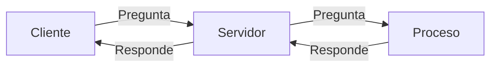

## ¿Qué ocuerre en el Proceso Cliente/Servidor?
El proceso comienza cuando el **Cliente** le realiza una petición de un recurso al **Servidor**. Este último, realizara una petición interna al **Proceso** que el **Cliente** ha solicitado para poder conectarlos. El **Proceso** respondera al **Servidor** y, finalmente, el **Servidor** pone en disposición el recurso solicitado por el **Cliente**.

##### Grafico ilustrativo

